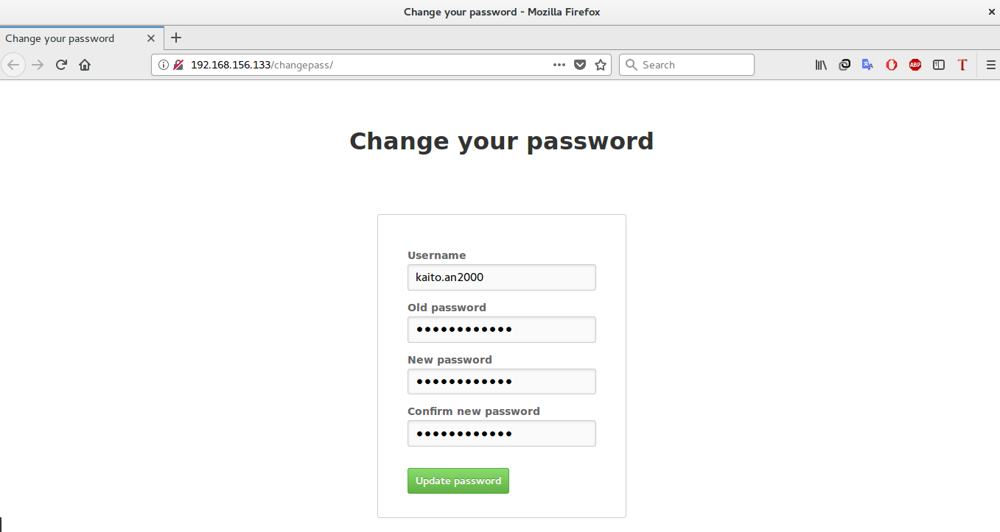

= Web UI for changing LDAP password
Jakub Jirutka <https://github.com/jirutka[@jirutka]>
//custom
:proj-name: ldap-passwd-webui
:gh-name: jirutka/{proj-name}
:wikip-url: https://en.wikipedia.org/wiki
:pypi-url: https://pypi.python.org/pypi

The aim of this project is to provide a very simple web form for users to be able to change their password stored in LDAP or Active Directory (Samba 4 AD).
It’s built with http://bottlepy.org[Bottle], a WSGI micro web-framework for Python.

== Installation

=== Manually

Clone this repository and install dependencies:

[source, sh, subs="+attributes"]
----
git clone git@github.com:{gh-name}.git
cd {proj-name}
pip install -r requirements.txt
----

Read the next sections to learn how to run it.

=== Requirements

* Python 3.x
----
yum install epel-release
yum install python34
yum install uwsgi-plugin-python3
----
* {pypi-url}/bottle/[bottle]
* {pypi-url}/ldap3[ldap3] 2.x

== Configuration

Configuration is read from the file link:settings.ini.example[settings.ini].
You may change location of the settings file using the environment variable `CONF_FILE`.

If you have Active Directory (or Samba 4 AD), then you *must* use encrypted connection (i.e. LDAPS or StartTLS) – AD doesn’t allow changing password via unencrypted connection.

== Run it

There are multiple ways how to run it:

* with the built-in default WSGI server based on https://docs.python.org/3/library/wsgiref.html#module-wsgiref.simple_server[wsgiref],
* under a {wikip-url}/Web_Server_Gateway_Interface[WSGI] server like https://uwsgi-docs.readthedocs.org[uWSGI], https://docs.pylonsproject.org/projects/waitress[Waitress], http://gunicorn.org[Gunicorn], … (recommended)
* as a {wikip-url}/Common_Gateway_Interface[CGI] script.

=== Run with the built-in server

Simply execute the `app.py`:

[source, python]
python3 app.py

Then you can access the app on http://localhost:8080.
The port and host may be changed in link:settings.ini.example[settings.ini].

=== Run with uWSGI and nginx

If you have many micro-apps like this, it’s IMO kinda overkill to run each in a separate uWSGI process, isn’t it?
It’s not so well known, but uWSGI allows to “mount” multiple application in a single uWSGI process and with a single socket.

[source, ini, subs="+attributes"]
.Sample uWSGI configuration:
----
[uwsgi]
plugins = python3
socket = /zserver/uwsgi/run/main.sock
uid = uwsgi
chown-socket = uwsgi:nginx
chmod-socket = 660
chdir = /zserver/uwsgi
logto = /zserver/uwsgi/var/log/main.log
mount = /changepass=/zserver/uwsgi/ldap-passwd-webui/app.py
manage-script-name = true
processes = 4
threads = 2
----

[source, nginx]
.Sample nginx configuration as a reverse proxy in front of uWSGI:
----
upstream uwsgi_app {
    server unix:/zserver/uwsgi/run/main.sock;
}
server {
    listen 80;
    server_name 192.168.156.133;

    location /changepass/ {
        uwsgi_pass uwsgi_app;
        include     uwsgi_params;
    }
}
----

.Sample systemd script for uwsgi service /etc/systemd/system/uwsgi.service
----
[Unit]
Description=uWSGI instance to serve ldap-passwd-webui

[Service]
ExecStartPre=/usr/bin/bash -c 'chown uwsgi:nginx /zserver/uwsgi/run'
ExecStart=/usr/bin/bash -c 'cd /zserver/uwsgi; uwsgi --ini app.ini'
Restart=always
KillSignal=SIGQUIT
Type=notify
NotifyAccess=all

[Install]
WantedBy=multi-user.target

----
== Screenshot

== License

This project is licensed under http://opensource.org/licenses/MIT/[MIT License].
For the full text of the license, see the link:LICENSE[LICENSE] file.
